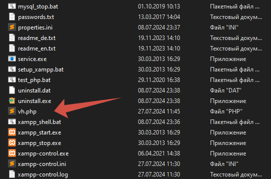
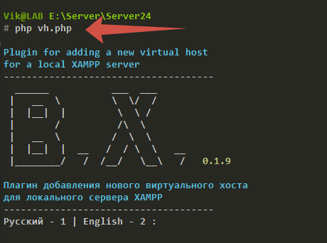

## Виртуаьлный Хост

Если вы используете локальный сервер XAMPP для своих проектов, этот простой, но удобный плагин будет Вам очень полезен.

Теперь нет необходимости каждый раз заходить в системный файл **_hosts_**, а так же в xammp файл **_httpd-vhosts_** и вручную прописывать данные нового проекта для корректного открытия вашего локального сайта в браузере.

Нужно лишь один раз поместить файл **_vh.php_** в корневой каталог XAMPP, а когда создаёте новый проект, запустите его через консоль находясь в папке XAMPP, прописав лишь название Вашего нового проекта, остальное он сделает сам.

**Экономьте Ваше время**

## Установка

> Скопировать <u>**vh.php**</u> в корневой каталог XAMPP



## Использование

> 1.  Находясь в корневом каталоге XAMMP, где расположен файл **vh.php**, запустить консоль (или запустить консоль и перейти в корневой каталог XAMPP) и прописать - **php vh.php**, запустить его выполнение

```
php vh.php
```



> 2. Следовать указаниям
