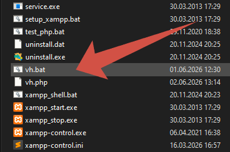
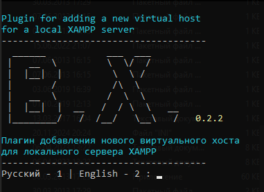

## Виртуальный Хост

Если вы используете локальный сервер XAMPP для своих проектов, этот простой, но удобный скрипт будет Вам очень полезен.

Теперь нет необходимости каждый раз заходить в системный файл **_hosts_**, а так же в xammp файл **_httpd-vhosts_** и вручную прописывать данные нового проекта для корректного открытия вашего локального сайта в браузере.

Нужно лишь один раз поместить файл **_vh.bat_** и **_vh.php_** в корневой каталог XAMPP, а когда создаёте новый проект, запустите **_vh.bat_** двойным кликом, находясь в папке XAMPP, прописав лишь название Вашего нового проекта, остальное он сделает сам.

**Цените Ваше время**

## Требования

> Windows 8.1 +  
> XAMPP  
> PHP 7 +  
> Должна быть активирована возможность изменения/записи системного файла **hosts** в свойствах безопасности этого файла

## Установка

> Скопировать <u>**vh.bat** и **vh.php**</u> в корневой каталог XAMPP

## Использование

> 1.  Находясь в корневом каталоге XAMMP, где расположен файлы **vh.bat** и **vh.php**, двойным кликом запустите файл **vh.bat**

> 2. Следовать указаниям
